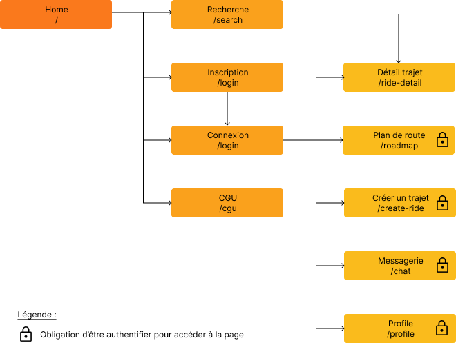

# PapoteCar Front

## Introduction

Ce projet a été réalisé dans le cadre de notre Master sur le cours : Séparation Backend / Front-End.

PapoteCar est une nouvelle entreprise de covoiturage engagée dans la sauvegarde de l’environnement dans le Green-IT. Elle permet à des particuliers de proposer des places dans leur voiture lors de leurs trajets. Vous devez développer le portail Web qui permettra aux usagers d’utiliser les services de cette entreprise.

### Les objectifs à remplir :

Les fonctionnalités :

- [x] Ajouter un trajet
- [ ] Modifier un trajet
- [ ] Supprimer un trajet
- [x] S’inscrire sur un trajet
- [ ] Se désinscrire sur un trajet
- [x] Proposer un tableau de bord permettant de voir l’état des trajets en cours
- [x] Proposer un tableau de bord permettant de voir les trajets réservés par un passager
- [x] Authentification
- [x] Se renseigner sur les nouvelles réglementations RGPD en vigueur pour que vous et votre client soient en règle vis-à-vis des dispositifs légaux
- [-] Système de messagerie permettant à l’ensemble des personnes d’une voiture de discuter avant et après le trajet.
- [ ] Un trajet peut avoir plusieurs étapes sur lesquelles un nouveau passager peut descendre ou monter
- [-] Les passagers doivent être validés par le conducteur

Fonctionnalités supplémentaires :

- [x] Modifier son profil
- [x] Supprimer son profil
- [x] Rechercher un trajet

Attendu minimum

- [x] Maquetter une application responsive : [lien de la maquette](https://www.figma.com/proto/MMXLA9iA32F5cpWPNzyStq/PapoteCar?node-id=76%3A1300&scaling=scale-down&starting-point-node-id=76%3A1301)
- [x] Concevoir une charte graphique cohérente
- [x] Analyser et concevoir une application selon un cahier des charges
- [x] Développer des composants d’accès aux données
- [x] Développer la partie Front-End d’une interface utilisateur
- [x] Développer la partie Back-End d’une interface utilisateur
- [x] Communication front / back effective

Attendu front :

- [x] Qualité de l'expérience utilisateur (y compris mobile)

Bonus :

- [x] Déploiement de l'application

### Contributeurs:

Les membres constituant le groupe sont les suivants :

- Axelle GUINAUDEAU ([Theia01](https://github.com/Theia01))
- Medi DEMIRDELEN ([medi-demirdelen](https://github.com/medi-demirdelen))
- Camille NAULET ([camillenaulet03](https://github.com/camillenaulet03))
- Lily MAJANI ([lilymajani](https://github.com/lilymajani))

## Getting started

### Mettre en place le projet

Il vous faut **cloner le projet :**

```sh
git clone https://github.com/PapoteCarYnov/papote-car-front.git
```

Par la suite, déplacez-vous à l'intérieur du dossier :

```sh
cd papote-car-front
```

Puis installez les dépendances requises au projet:

```sh
npm install
```

Il sera également nécessaire de récupérer `.env` :

```sh
cp .env.dev .env
```

Pour utiliser toutes les fonctionnalités de l'application en local, il vous faudra également cloner et lancer le Back : [PapoteCar Back](https://github.com/PapoteCarYnov/papote-car-back)

Pour terminer, afin de lancer l'application, lancez la commande :

```sh
npm run serve -- --port 8081
```

## Plan du site



## Déploiement

Le site est actuellement en ligne : [https://renard-temporaire.netlify.app/](https://renard-temporaire.netlify.app/)
